<p align="center">
  
</p>

## Repository Structure

```
src/
├── facility/                    # Core orchestration hub
│   ├── Facility.sol             # Main entry point combining all modules
│   ├── IntentDescriptor.sol     # ERC-6909 metadata provider
│   └── base/                    # Abstract base contracts
│       ├── FacilityIntents.sol      # Intent lifecycle management
│       ├── FacilityLP.sol           # Liquidity provider operations
│       ├── FacilityFunds.sol        # Fund order operations
│       ├── FacilityRequests.sol     # Request contract coordination
│       ├── FacilityPositionManager.sol  # Position manager integration
│       ├── FacilitySwap.sol         # Token swapping
│       └── FacilityRoles.sol        # Access control
├── request/                     # Dual-token PT/YT vault system
│   ├── Request.sol              # Main request contract
│   ├── RequestFactory.sol       # Beacon proxy factory
│   ├── Vault.sol                # ERC4626-style redemption vault
│   └── abstract/                # Base contracts and token controllers
├── manager/                     # Multi-position aggregator
│   ├── PositionManager.sol      # Main position manager
│   ├── PositionManagerFactory.sol   # Beacon proxy factory
│   ├── base/                    # Admin, fees, shares, rebalancing
│   └── rebalancer/              # Flash-loan based rebalancer
├── funds/                       # External asset wrappers
│   ├── centrifuge/
│   │   ├── CentrifugeFund.sol       # Centrifuge ERC-7540 integration
│   │   └── CentrifugeFundFactory.sol # Beacon proxy factory
│   ├── pareto/
│   │   ├── ParetoFund.sol           # Pareto (Idle Finance) CDO integration
│   │   └── ParetoFundFactory.sol    # Beacon proxy factory
│   ├── USCC/
│   │   ├── USCCFund.sol             # Superstate USCC integration
│   │   └── USCCFundFactory.sol      # Beacon proxy factory
│   └── WrappedAsset.sol         # Wrapper token (wUSCC, etc.)
├── borrow/                      # Lending protocol integrations
│   ├── MorphoBorrowPosition.sol     # Morpho Blue position
│   └── MorphoBorrowPositionFactory.sol  # Beacon proxy factory
├── guard/                       # Compliance controls
│   ├── TransferGuard.sol        # Blocklist/whitelist transfer guard
│   └── TransferGuardFactory.sol # Beacon proxy factory
├── interfaces/                  # All interface definitions
└── libs/                        # Shared libraries
    ├── facility/                # Facility storage, intent, errors
    ├── manager/                 # Position manager operations
    ├── request/                 # Minting auth, token controller
    └── borrow/                  # Morpho shares math
```

## Architecture Overview

The protocol consists of interconnected modules orchestrated through the **Facility** contract:

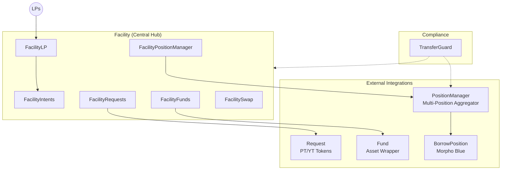

## Roles & Connections

This section provides a consolidated view of all roles across contracts and how they connect in a typical deployment.

### Role Summary by Contract

| Contract | Role | Typical Holder | Permissions |
|----------|------|----------------|-------------|
| **Facility** | Owner | Protocol Admin | Create intents, update target asset, set descriptor |
| | Facilitator | Operations Bot | Create intents, lock, resolve, set caps, set fund/request, all fund/request/PM/swap operations |
| | Guardian | Signers (EOA) | Sign swap authorizations (multi-sig for quorum) |
| | Compliance | Emergency Admin / Compliance Bot | Pause/unpause facility, revert deposits |
| **Request** | Owner | Protocol Admin | Mark loan as repaid, authorize minting |
| | Puller | Facility | Pull bridge loan funds, repay funds |
| | Consumer | Protocol Admin | Consume signed offers |
| **USCCFund** | Depositor | Facility | Create/cancel/commit/unlock/recover orders |
| | Operator | Operations Bot | Settle fund state after external operations |
| **CentrifugeFund** | Owner | Protocol Admin | Cancel vault requests via `cancelRequest()` |
| | Operator | Operations Bot | Cancel vault requests via `cancelRequest()` |
| | Depositor | Facility | Create/cancel/commit/unlock/recover orders |
| **ParetoFund** | Owner | Protocol Admin | Resolve stuck orders |
| | Operator | Operations Bot | Resolve stuck orders |
| | Depositor | Facility | Create/cancel/commit/unlock orders |
| **PositionManager** | Owner | Protocol Admin | Add modules, set LLTV, set fees |
| | Minter | Facility | Deposit, withdraw, burn shares |
| | Curator | Operations Bot | Set supply/withdrawal queues |
| | Rebalancer | Rebalancer Contract | Execute rebalancing operations |
| **BorrowPosition** | Owner | PositionManager | All borrow/supply operations |
| **TransferGuard** | Owner | Protocol Admin | Set token config, grant roles |
| | Pauser | Emergency Admin | Pause/unpause tokens |
| | Compliance | Compliance Bot | Set address blocklist/whitelist status |

### Typical Deployment Connections

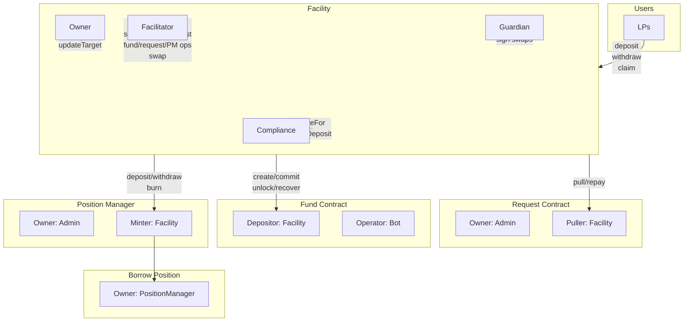

**Notes:**
- Multiple Funds/Requests can be attached to a Facility (one per intent)
- Multiple Intents can share the same PositionManager
- Each Fund should only serve one intent to avoid conflicts

### State Transitions & Requirements

The Facility enforces strict state transitions for each intent:

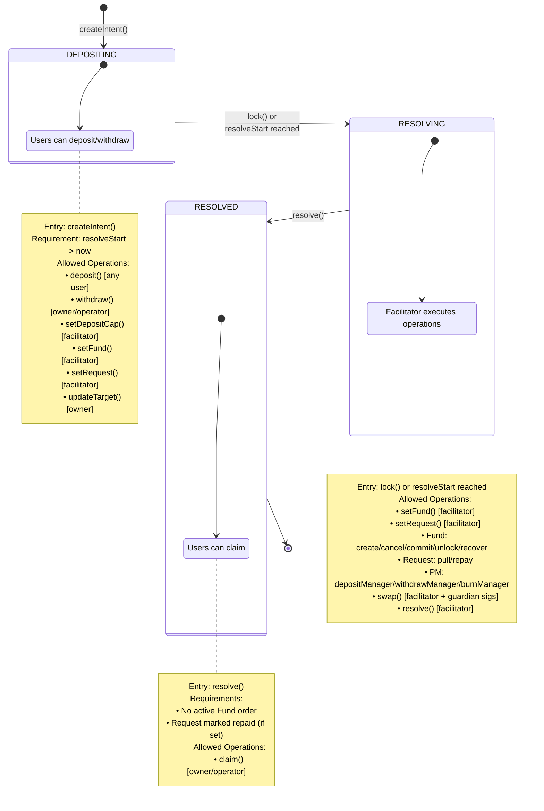

### Function Access Control Reference

| Function | Required Role | Required State | Additional Checks |
|----------|--------------|----------------|-------------------|
| `createIntent` | Owner/Facilitator | Any | resolveStart > now |
| `updateTarget` | Owner | DEPOSITING | - |
| `setDepositCap` | Facilitator | DEPOSITING | - |
| `lock` | Facilitator | DEPOSITING | - |
| `setFund` | Facilitator | Any | No active order |
| `setRequest` | Facilitator | Any | Request repaid (if previously set) |
| `resolve` | Facilitator | RESOLVING | No active order, request repaid |
| `deposit` | Any | DEPOSITING | Within deposit cap |
| `withdraw` | Owner/Operator | DEPOSITING | Sufficient balance |
| `claim` | Owner/Operator | RESOLVED | Sufficient balance |
| `create` (fund) | Facilitator | RESOLVING | Fund set, no active order |
| `cancel` (fund) | Facilitator | RESOLVING | Active order exists |
| `commit` (fund) | Facilitator | RESOLVING | Active order exists |
| `unlock` (fund) | Facilitator | RESOLVING | Order in unlocking state |
| `recover` (fund) | Facilitator | RESOLVING | Order in recovering state |
| `pull` (request) | Facilitator | RESOLVING | Request set |
| `repay` (request) | Facilitator | RESOLVING | Request set |
| `depositManager` | Facilitator | RESOLVING | Asset is PositionManager |
| `withdrawManager` | Facilitator | RESOLVING | Asset is PositionManager |
| `burnManager` | Facilitator | RESOLVING | Asset is PositionManager |
| `swap` | Facilitator | RESOLVING | Valid signatures, quorum met |
| `revertDeposit` | Owner/Compliance | DEPOSITING | Deposit asset balance >= totalSupply; only owner can set receiver != from |
| `pauseFor` | Owner/Compliance | Any | duration=0 to unpause |

## Facility

The `Facility` contract is the central orchestration hub that manages **intents** - configurable funding requests that coordinate deposits, fund operations, and claims.

### Intent Structure

Each intent tracks:
- **Deposit Asset**: The asset LPs deposit (can be a PositionManager)
- **Target Asset**: The target for fund operations (can be a PositionManager)
- **Fund**: Optional fund wrapper for external asset processing
- **Request**: Optional request contract for PT/YT issuance
- **Guard Key**: PositionManager used for transfer compliance checks

### Intent Lifecycle

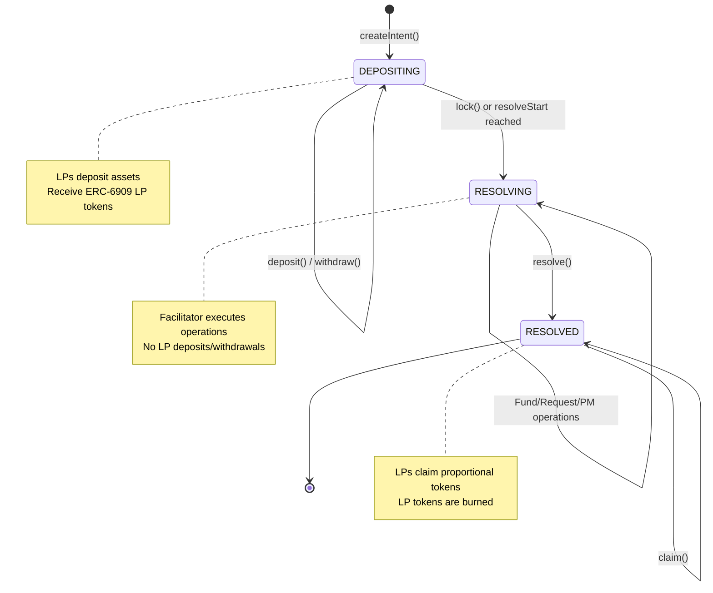

### LP Operations

| Phase | Function | Description |
|-------|----------|-------------|
| Depositing | `deposit(id, amount)` | Deposit asset, receive LP tokens 1:1 |
| Depositing | `withdraw(id, from, receiver, amount)` | Burn LP tokens, receive asset 1:1 |
| Depositing | `revertDeposit(id, from, receiver)` | Owner/Compliance force-withdraws a user's full deposit. Only owner can set receiver != from |
| Resolved | `claim(id, from, receiver, shares)` | Burn LP tokens, receive proportional share of all accumulated tokens. Returns `(tokens[], amounts[])` for easy tracking of claimed assets |

### View Functions

| Function | Description |
|----------|-------------|
| `intentBalances(id)` | Returns all tokens and their balances held by an intent as parallel arrays `(tokens[], amounts[])` |
| `getIntent(id)` | Returns the full intent properties and current state |
| `totalSupply(id)` | Returns total LP token supply for an intent |

### Facilitator Operations

The facilitator role can:
- `lock(id)` - Force intent into resolving phase
- `setDepositCap(id, cap)` - Update deposit cap
- `setFund(id, fund)` - Attach/detach fund wrapper
- `setRequest(id, request)` - Attach/detach request contract
- `resolve(id)` - Mark intent as resolved, enabling claims

### Role-Based Access

| Role | Permission |
|------|------------|
| Owner | Create intents, update target, set descriptor, revert deposits (custom receiver) |
| Facilitator | Lock, resolve, set caps, attach fund/request, execute operations |
| Compliance | Pause/unpause facility, revert deposits |

## Request Contract

The `Request` contract implements a dual-token (PT/YT) funding mechanism for structured products.

### Dual-Token Model

When depositing into a request, funders receive:
- **Principal Tokens (PT)**: Represent the deposited principal (1:1 with assets)
- **Yield Tokens (YT)**: Represent expected yield (based on expectedReturn)

**Example**: Depositing 1,000,000 USDC with 10% expected return:
- Receive: 1,000,000 PT + 100,000 YT

### Redemption Formula

```
principalAssets = min(totalAssets, ptSupply)
yieldAssets = totalAssets - principalAssets

pricePerPT = principalAssets / ptSupply
pricePerYT = yieldAssets / ytSupply
```

| Total Assets | Principal Assets | Yield Assets | PT Price | YT Price |
|--------------|------------------|--------------|----------|----------|
| 900,000 | 900,000 | 0 | 0.9 | 0 |
| 1,000,000 | 1,000,000 | 0 | 1.0 | 0 |
| 1,050,000 | 1,000,000 | 50,000 | 1.0 | 0.5 |
| 1,200,000 | 1,000,000 | 200,000 | 1.0 | 2.0 |

**Key Properties:**
- PT holders are prioritized (up to 1:1 redemption)
- YT holders capture any upside beyond principal
- If assets < principal, PT holders share the loss proportionally

### Request Lifecycle

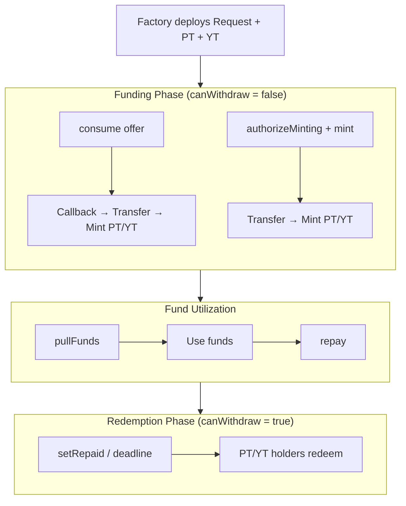

### Funding Methods

#### Method 1: Signed Offer Consumption

```solidity
struct Offer {
    address maker;          // Funder receiving PT/YT
    uint256 amount;         // Reference principal
    uint256 expectedReturn; // Expected yield
    uint256 nonce;          // Sequential (must be > stored)
    uint256 expiration;     // Validity deadline
    bool useCallback;       // Whether to call onRequestConsumed
}

// YT calculated proportionally
ytAmount = offer.expectedReturn * ptAmount / offer.amount
```

**Callback Interface** (when `useCallback = true`):

```solidity
interface IRequestCallback {
    function onRequestConsumed(
        Offer calldata offer,
        bytes calldata signature,
        uint256 principal,  // PT amount being minted
        uint256 yield       // YT amount being minted
    ) external;
}
```

The callback is invoked **before** funds are pulled, allowing the maker to:
- Withdraw from DeFi positions
- Move funds from internal accounting
- Set ERC20 allowances for the Request contract

#### Method 2: Authorized Minting

```solidity
// Owner authorizes
request.authorizeMinting(funder, 1_000_000e6, 100_000e6);

// Funder mints (after approving asset)
asset.approve(address(request), 1_000_000e6);
request.mint(); // Receives 1M PT + 100k YT
```

### Fund Management

After funding is complete:

1. **Pull Funds**: Puller calls `pullFunds(amount, data)` to transfer assets to themselves
2. **Callback**: If `data.length > 0`, invokes `onPullFunds(amount, data)` on the puller
3. **Utilization**: Puller uses funds for intended purpose
4. **Repayment**: Transfer assets back via `repay(amount)` or direct transfer
5. **Enable Redemptions**: Owner calls `setRepaid(uint256 minBalance)` or wait for `repaymentDeadline`

**Puller Callback Interface**:

```solidity
interface IRequestInteractionsCallback {
    function onPullFunds(uint256 amount, bytes calldata data) external;
}
```

The callback is invoked **after** funds are transferred, allowing automated strategies.

### Nonce Management

Nonces enable flexible offer lifecycle:
- **Starting Value**: Must start at 1 (nonce 0 is invalid)
- **Soft Cancel**: Coordinate off-chain to ignore offers
- **Hard Cancel**: Set nonce on-chain to invalidate all offers at or below that nonce

### Role-Based Access

| Role | Permission |
|------|------------|
| Owner | setRepaid, authorizeMinting, consume |
| Consumer | authorizeMinting, consume |
| Puller | pullFunds |

## Fund Module

The fund module standardizes wrapping external assets through a state machine interface.

### Order State Machine

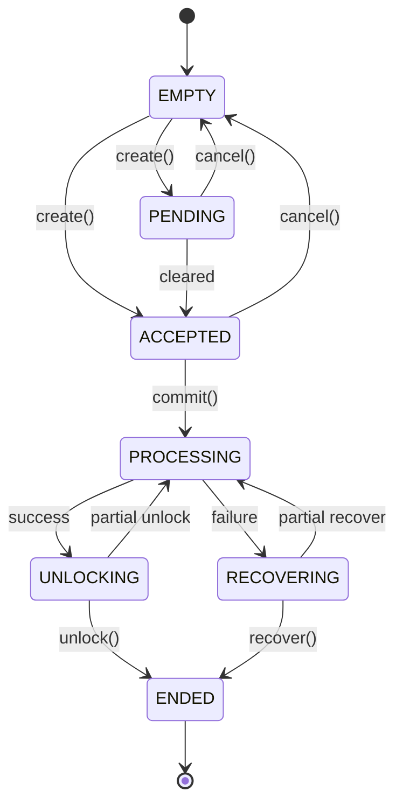

### Order Modes

| Mode | Input | Output |
|------|-------|--------|
| DEPOSIT | Asset (e.g., USDC) | Shares (e.g., wUSCC) |
| REDEEM | Shares (e.g., wUSCC) | Asset (e.g., USDC) |

### USCC Integration (Superstate)

`USCCFund` wraps Superstate USCC tokens with a wrapper token (`wUSCC`):

**Deposit Flow (USDC → wUSCC):**
1. `create(DEPOSIT)` - Initialize order
2. `commit()` - Transfer USDC to Superstate recipient
3. `unlock()` - Mint wUSCC to receiver once USCC is minted

**Redeem Flow (wUSCC → USDC):**
1. `create(REDEEM)` - Initialize order
2. `commit()` - Burn wUSCC, trigger off-chain redemption
3. `unlock()` - Release USDC when settled (or `recover()` if failed)

### Centrifuge ERC-7540 Integration

`CentrifugeFund` wraps Centrifuge ERC-7540 async vaults. Shares are represented by WrappedAsset tokens wrapping the vault's share token.

**Key Design Decisions:**
- Uses an **internal state pattern**: the stored `internalState` may differ from what `state()` returns, because `state()` queries the Centrifuge vault for claimable amounts to detect async transitions (e.g., PROCESSING → UNLOCKING).
- All vault calls use **requestId = 0**, the Centrifuge convention for "the current request for this controller" (each controller has at most one active request).
- Supports **partial fills**: Centrifuge processes requests across epochs, so `unlock()` / `recover()` can be called multiple times, returning to PROCESSING between partial claims.

**Deposit Flow (Asset → WrappedShare):**
1. `create(DEPOSIT)` - Initialize order (validates slippage against current exchange rate)
2. `commit()` - Pull assets, approve vault, call `requestDeposit()`
3. *Wait for Centrifuge epoch processing*
4. `unlock()` - Claim shares via `mint()`, wrap into WrappedAsset, send to receiver

**Redeem Flow (WrappedShare → Asset):**
1. `create(REDEEM)` - Initialize order
2. `commit()` - Burn WrappedAsset (unwrap), approve share tokens, call `requestRedeem()`
3. *Wait for Centrifuge epoch processing*
4. `unlock()` - Claim assets via `withdraw()`, send to receiver

**Recovery Flow (cancel a pending request):**
1. `cancelRequest()` - Owner/operator submits cancellation to Centrifuge vault
2. *Wait for Centrifuge to process the cancellation*
3. `recover()` - Claim returned assets/shares, send to receiver

### Pareto (Idle Finance) CDO Integration

`ParetoFund` wraps an IdleCDOEpochVariant (the Pareto/Idle credit vault). Shares are represented by WrappedAsset tokens wrapping the AA (senior) tranche token.

**Key Design Decisions:**
- Uses an **internal state pattern** (like Centrifuge): the stored `internalState` may differ from what `state()` returns, because `state()` queries the CDO and its strategy to detect async transitions (e.g., PROCESSING → UNLOCKING).
- Deposits are **synchronous** — `depositAA()` succeeds or reverts atomically. No epoch wait is needed for deposits.
- Withdrawals are **epoch-gated** — `requestWithdraw()` queues a withdrawal that completes after the CDO epoch ends, then `claimWithdrawRequest()` delivers the underlying assets.
- **No recovery flow** — `recover()` always reverts with `RecoverNotSupported()`. Deposits are atomic (no stuck intermediate state) and withdrawals always complete after epoch processing.
- `resolve()` allows the operator/owner to override input/output amounts for an order stuck in PROCESSING when received amounts differ from expected values.

**Deposit Flow (Asset → WrappedShare):**
1. `create(DEPOSIT)` - Initialize order (validates Keyring wallet allowance)
2. `commit()` - Pull assets, call `depositAA()` atomically — AA tranche tokens are received immediately
3. `unlock()` - Wrap AA tranche tokens into WrappedAsset, send to receiver

**Redeem Flow (WrappedShare → Asset):**
1. `create(REDEEM)` - Initialize order
2. `commit()` - Burn WrappedAsset (unwrap to AA tranche), call `requestWithdraw()` on CDO
3. *Wait for CDO epoch to end*
4. `unlock()` - Call `claimWithdrawRequest()`, send underlying assets to receiver

## Position Manager

The `PositionManager` aggregates multiple `IBorrowPosition` contracts into a single vault with ERC20 share-based accounting.

### Architecture

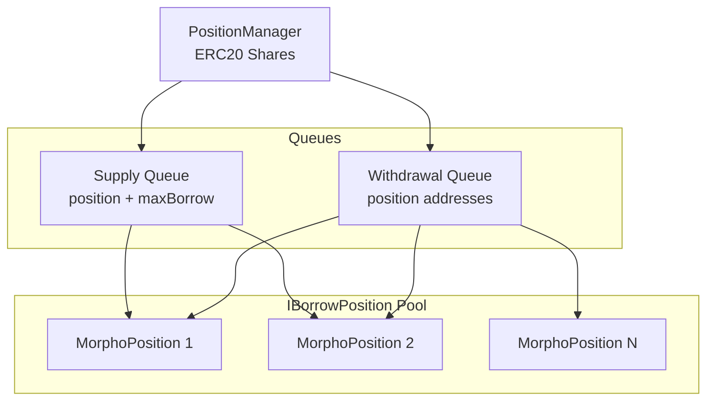

### Key Concepts

**Total Assets**: Net value of all positions:
```
totalAssets = Σ(collateralQuoted) - Σ(debt)
```
Where `collateralQuoted` is collateral value in debt asset terms using each position's oracle.

**Supply Queue**: Ordered list of positions with borrow caps for deposits. Each entry contains:
- `position`: The IBorrowPosition contract address
- `maxBorrow`: Maximum amount to borrow from this position per deposit

**Withdrawal Queue**: Ordered list of position addresses for withdrawals and burns.

### Share Calculation

Uses virtual offset to prevent inflation attacks (similar to ERC4626):

```
shares = assets × (totalSupply + 1e6) / (totalAssets + 1)
assets = shares × (totalAssets + 1) / (totalSupply + 1e6)
```

### Deposit

Deposits collateral and borrows debt across positions in the supply queue, respecting the position manager's target LTV.

```solidity
function deposit(uint256 collateral, uint256 debt) external returns (int256 shares);
```

**Flow:**
1. Pull collateral from caller
2. If `debt == 0`: supply all collateral to first position
3. If `debt > 0`: iterate through supply queue:
   - For each position, calculate the initial borrow: `min(availableLiquidity, maxBorrow, remainingDebt)`
   - Query the position for required collateral at the target LTV via `collateralForBorrow(toBorrow, ltv)`
   - If not enough collateral remains, reduce the borrow to what the remaining collateral supports via `borrowForCollateral(remainingCollateral, ltv)`
   - Supply collateral and execute borrow
4. Deposit any leftover collateral (not needed for borrowing) into the first supply queue position
5. Transfer borrowed debt to caller
6. Mint/burn shares based on total assets change

**LTV Enforcement:** Each position is individually constrained to the target LTV. The `collateralForBorrow` and `borrowForCollateral` functions account for the position's existing collateral and debt, so positions with excess collateral may not need additional collateral for new borrows.

**Example:**
```
Supply Queue: [(PositionA, maxBorrow=1000), (PositionB, maxBorrow=2000)]
Deposit: collateral=1500, debt=2000, ltv=70%

Position A: available=800 → collateralForBorrow(800, 0.7) = 1143 → supplies 1143, borrows 800
Position B: remaining collateral=357 → borrowForCollateral(357, 0.7) = 250 → supplies 357, borrows 250
Remaining debt = 2000 - 800 - 250 = 950 → reverts InsufficientBorrowCapacity

With enough collateral (e.g., 3000):
Position A: borrows 800, needs 1143 collateral
Position B: borrows 1200, needs 1714 collateral → total 2857, leftover 143 → first position
```

### Withdraw

Withdraws collateral and repays debt across positions in the withdrawal queue.

```solidity
function withdraw(uint256 collateral, uint256 debt) external returns (int256 shares);
```

**Flow:**
1. Pull debt from caller for repayment
2. **First pass** - Repay debt through withdrawal queue
3. **Second pass** - Withdraw collateral through withdrawal queue (respects available collateral at LLTV)
4. Transfer collateral to caller
5. Mint/burn shares based on total assets change

**Available Collateral:**
```
availableCollateral = totalCollateral - requiredCollateral
requiredCollateral = debt × ORACLE_PRICE_SCALE / (lltv × collateralPrice)
```

Only "available" collateral can be withdrawn without repaying debt, ensuring positions remain healthy.

### Burn

Burns shares to exit proportionally, maintaining average LTV across all positions.

```solidity
function burn(uint256 shares) external returns (uint256 collateral, uint256 debt);
```

**Flow:**
1. Calculate proportional amounts:
   ```
   collateral = totalCollateral × shares / totalSupply  (round down)
   debt = totalDebt × shares / totalSupply  (round up)
   ```
2. Burn shares from caller
3. Pull debt from caller for repayment
4. Process through withdrawal queue proportionally
5. Transfer collateral to caller

### Rebalancing

The `rebalance` function allows redistributing collateral and debt across positions without affecting shares.

**Position Validation:** All positions referenced in rebalancing operations must be registered in the `borrowModules` set (added via `addBorrowModule`). Attempting to rebalance with unregistered positions reverts with `UnauthorizedPosition()`.

```solidity
struct RebalancingData {
    uint256 collateral;  // Collateral to pull from caller
    uint256 debt;        // Debt to pull from caller
    RebalancingOperation[] operations;
}

struct RebalancingOperation {
    address position;
    RebalancingOperationType operationType;  // REPAY, WITHDRAW, BORROW, SUPPLY
    uint256 amount;
}
```

**Example - Move liquidity from Position A to Position B:**
```solidity
RebalancingData({
    collateral: 0,
    debt: 1000,  // Need debt token to repay on A
    operations: [
        (positionA, REPAY, 1000),
        (positionA, WITHDRAW, 2000),
        (positionB, SUPPLY, 2000),
        (positionB, BORROW, 1000)
    ]
})
// Returns excess collateral and debt to caller
```

### Fee Mechanism

Fees are accrued before every operation:

**Management Fee**: Annual fee on total assets (basis points/year)
```
managementFeeAssets = totalAssets × managementFee × elapsedTime / (BPS × SECONDS_PER_YEAR)
```

**Performance Fee**: Fee on gains since last snapshot (basis points)
```
if (currentTotalAssets > lastTotalAssets):
    gains = currentTotalAssets - lastTotalAssets
    performanceFeeAssets = gains × performanceFee / BPS
```

Fees are minted as shares to the fee recipient, diluting existing shareholders.

### Role-Based Access

| Role | Permission |
|------|------------|
| Owner | Add/remove modules, set LLTV, set fees, set max rebalance loss |
| Minter | deposit, withdraw, burn |
| Curator | Set supply/withdrawal queues |
| Rebalancer | Execute rebalancing operations |

### Transfer Guard Integration

The Position Manager supports an optional `TransferGuard` for compliance controls. When set:
- All share transfers are validated through the guard
- Deposits/withdrawals are blocked when paused
- Rebalancing operations revert with `Paused()`

### MorphoRebalancer

A standalone rebalancer using Morpho flash loans:

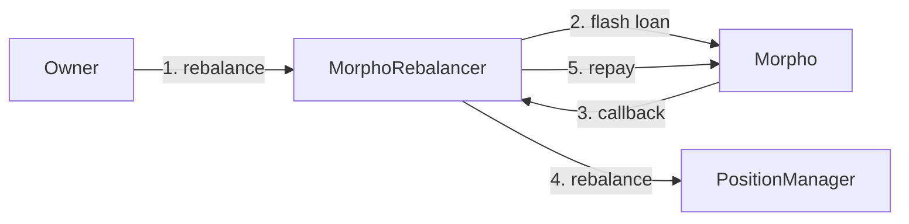

Requires `PM_ROLE_REBALANCER` on the Position Manager.

## Borrow Module

### MorphoBorrowPosition

Individual position wrapper for Morpho Blue with custom pre-liquidation:

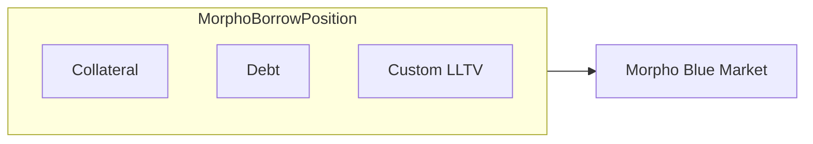

**Key Features:**
- Custom LLTV per position (immutable after init, must be > 0 and ≤ market LLTV)
- Proportional pre-liquidation mechanism
- ERC-7201 namespaced storage for proxy compatibility

**Initialization:**
```solidity
function initialize(
    IMorpho morpho,      // Morpho Blue protocol contract
    Id marketId,         // Morpho market ID
    address positionManager,  // Owner controlling this position
    uint256 lltv         // Custom LLTV (immutable)
) external;
```

### Operations

| Function | Description |
|----------|-------------|
| `supplyCollateral(amount)` | Add collateral to increase borrowing capacity |
| `withdrawCollateral(amount)` | Remove collateral (enforces custom LLTV) |
| `borrow(amount)` | Borrow against collateral (enforces custom LLTV) |
| `repay(amount)` | Repay borrowed assets |
| `preLiquidate(...)` | Liquidate unhealthy positions |

### View Functions

| Function | Description |
|----------|-------------|
| `totalBorrowed()` | Current debt including accrued interest |
| `totalCollateral()` | Current collateral amount in position |
| `totalCollateralQuoted()` | Collateral value in debt asset terms (using oracle) |
| `isHealthy(lltv)` | Whether position is above specified LLTV |
| `maxBorrow(lltv)` | Maximum borrowable at given LLTV |
| `availableLiquidity()` | Available liquidity in market |
| `availableCollateral(lltv)` | Withdrawable collateral while maintaining health |
| `collateralForBorrow(amount, ltv)` | Additional collateral needed to borrow `amount` at `ltv` |
| `borrowForCollateral(amount, ltv)` | Additional borrow capacity from supplying `amount` at `ltv` |

### Health Factor & Pre-Liquidation

Position health is determined by:
```
collateralValue = collateral × oraclePrice / ORACLE_PRICE_SCALE
maxBorrow = collateralValue × lltv
isHealthy(lltv) = maxBorrow ≥ totalBorrowed
```

### Custom Pre-Liquidation Mechanism

Unlike Morpho's native liquidation (with liquidation incentive factor), MorphoBorrowPosition uses **proportional pre-liquidation** - liquidators receive collateral proportional to debt repaid.

**Liquidation Bonus Formula:**
```
Liquidation Bonus = 1 - LTV (at liquidation time)
```

**Example** at 80% LTV with 100 collateral ($100) and 80 debt ($80):

Liquidating 50% of debt ($40) seizes 50% of collateral ($50):
- Liquidator pays: $40 (debt)
- Liquidator receives: $50 (collateral)
- Profit: $10 = 20% bonus (1 - 0.80)

**Key Properties:**
- Liquidators receive proportional share of collateral
- Bonus scales with how underwater the position is
- No cap on seized collateral

### Liquidator Integration

```solidity
function preLiquidate(
    address borrower,      // The MorphoBorrowPosition address
    uint256 seizedAssets,  // Collateral to seize (0 to calculate from repaidShares)
    uint256 repaidShares,  // Debt shares to repay (0 to calculate from seizedAssets)
    bytes calldata data    // Callback data (empty for no callback)
) external returns (uint256 seizedAssets, uint256 repaidAssets);
```

**Input Options:**
- `seizedAssets > 0, repaidShares = 0` → specify collateral amount
- `seizedAssets = 0, repaidShares > 0` → specify debt shares
- Both non-zero or both zero → reverts with `InconsistentInput`

**Callback Interface:**

```solidity
interface IPreLiquidationCallback {
    function onPreLiquidate(uint256 repaidAssets, bytes calldata data) external;
}
```

Invoked (if `data` non-empty) after collateral transfer but before debt is pulled.

### MorphoBorrowPositionFactory

Deploys positions using beacon proxy pattern:

```solidity
address bp = factory.createBorrowPosition(
    morpho,          // IMorpho contract
    marketId,        // Morpho market ID
    positionManager, // Owner address
    0.72e18          // Custom LLTV (72%)
);
```

Monitor `BorrowPositionCreated` events to track deployments and their LLTV thresholds.

## Transfer Guard

Compliance controls for token transfers with blocklist/whitelist modes.

### Token Modes

| Mode | Behavior |
|------|----------|
| Blocklist | All addresses allowed EXCEPT those with BLOCKLIST status |
| Whitelist | Only addresses with WHITELIST status allowed |

### Address Status

| Status | Blocklist Mode | Whitelist Mode |
|--------|----------------|----------------|
| NONE | Allowed | Blocked |
| WHITELIST | Allowed | Allowed |
| BLOCKLIST | Blocked | Blocked |

### Transfer Validation

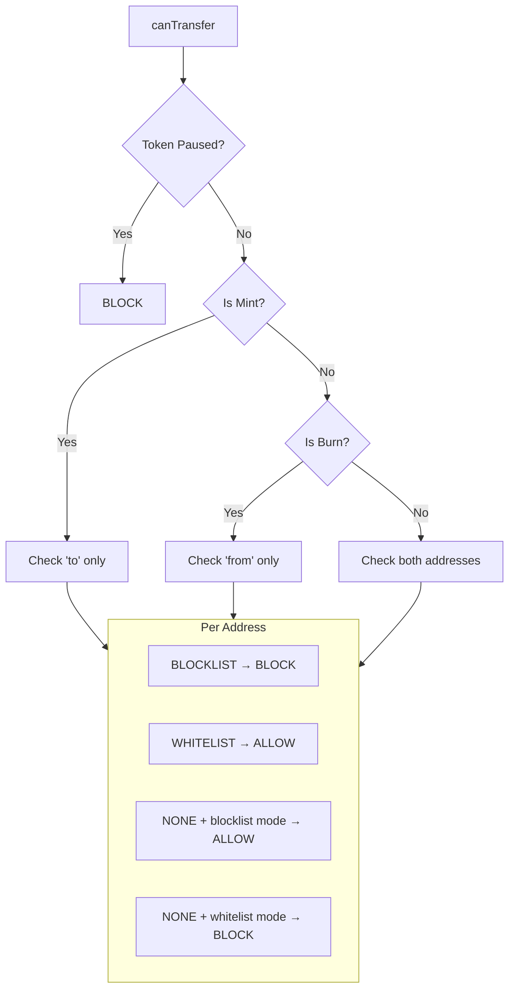

### Role-Based Access

| Role | Permission |
|------|------------|
| Owner | Set token config (paused, mode), grant roles |
| Pauser | Pause/unpause tokens |
| Compliance | Set address statuses |

### Usage Example

```solidity
// Deploy guard via factory
TransferGuardFactory factory = new TransferGuardFactory(beaconOwner);
address guard = factory.createTransferGuard(guardOwner);

// Configure (whitelist mode)
TransferGuard(guard).setTokenConfig(address(positionManager), false, true);

// Set address statuses
TransferGuard(guard).setAddressStatus(blockedUser, AddressStatus.BLOCKLIST);
TransferGuard(guard).setAddressStatus(allowedUser, AddressStatus.WHITELIST);

// Batch updates
address[] memory accounts = new address[](2);
accounts[0] = user1;
accounts[1] = user2;
TransferGuard(guard).setAddressStatusBatch(accounts, AddressStatus.WHITELIST);

// Connect to Position Manager
positionManager.setTransferGuard(guard);
```

## Factory Deployment Pattern

All major contracts use the **beacon proxy pattern** for gas-efficient, upgradeable deployments:

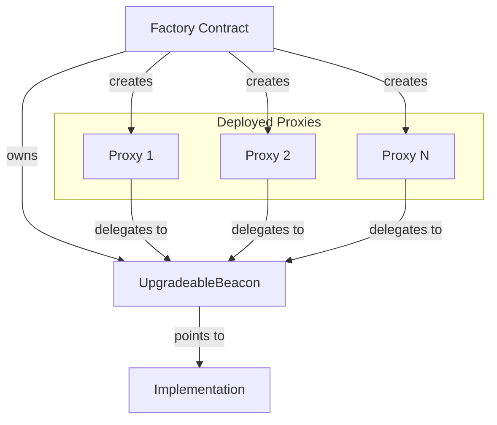

**Factories:**
- `RequestFactory` - Deploys Request + PT/YT vaults
- `PositionManagerFactory` - Deploys PositionManager instances
- `MorphoBorrowPositionFactory` - Deploys borrow positions
- `USCCFundFactory` - Deploys USCC fund wrappers
- `CentrifugeFundFactory` - Deploys Centrifuge ERC-7540 fund wrappers
- `ParetoFundFactory` - Deploys Pareto CDO fund wrappers
- `TransferGuardFactory` - Deploys transfer guards

**Upgrading:** The beacon owner can upgrade all proxies by updating the beacon's implementation.

## Security Considerations

| Mechanism | Purpose |
|-----------|---------|
| **Virtual Share Offset** | Prevents first-depositor inflation attacks in PositionManager |
| **Conservative Rounding** | Debt rounds up, collateral rounds down to protect vaults |
| **LTV Enforcement** | Deposits and withdrawals respect the target LTV per position |
| **Fee Accrual Ordering** | Fees always accrued before operations for fair accounting |
| **Role-Based Access** | Operations restricted to specific roles via OwnableRoles |
| **Reentrancy Guards** | `ReentrancyGuardTransient` on all state-changing operations |
| **Whitelisted Positions** | Only positions in `borrowModules` set can be used in queues |
| **Max Rebalance Loss** | Rebalancing reverts if total assets decrease beyond threshold |
| **ERC-7201 Storage** | Namespaced storage prevents collisions in proxy deployments |
| **EIP-712 Signatures** | Typed data signing for secure off-chain offer validation |

**Centralization Risks:**
- Guard owner can blocklist any address (use multisig/timelock for production)
- Beacon owner can upgrade all proxy implementations
- Facilitator has broad operational control over intent lifecycle
